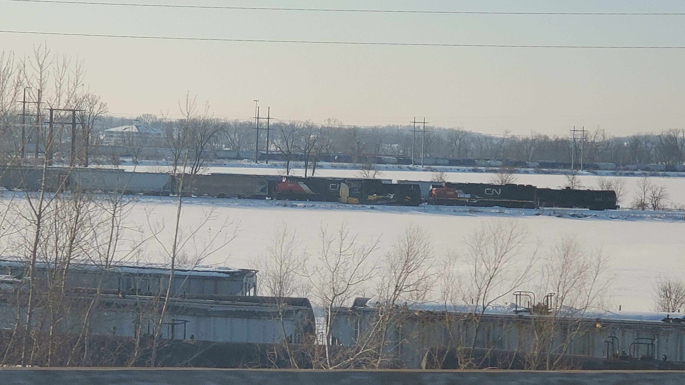
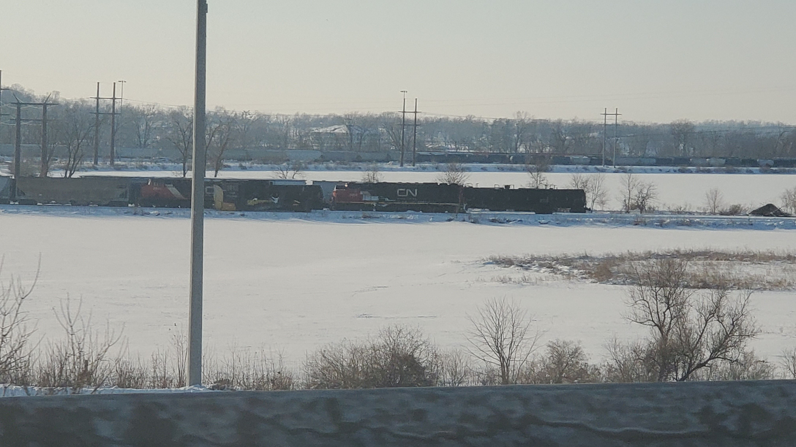

import Image from  '@site/src/components/Image';

Sorry for the bad picture quality, but this was taken from a moving vehicle on the interstate. This winter CN had one of their snowplows in the Cedar Lake yard in Cedar Rapids. The pictures were taken in February of 2021.

I didn't know what this was beforehand. They are called Jordan Spreaders. They were ordinally used to spread ballast along the tracks, but are also used to plow snow. Here is the Wikipedia link if you want the full history: <a href="https://en.wikipedia.org/wiki/Spreader_(railroad)">https://en.wikipedia.org/wiki/Spreader_(railroad)</a>. The pictures below are much better views of what spreaders look like with lots of retractable blades.

From <a href="https://www.flickr.com/photos/26063910@N00">Brian Hicks</a>:
<Image src="https://live.staticflickr.com/4422/35694226874_8721fe5b27_b.jpg" 
href="https://live.staticflickr.com/4422/35694226874_8721fe5b27_b.jpg"
flkr="https://www.flickr.com/photos/26063910@N00"/>

From <a href="https://www.flickr.com/photos/26063910@N00">Ed W</a>:
<Image src="https://live.staticflickr.com/1848/29805078527_192e94e055_b.jpg" 
href="https://live.staticflickr.com/1848/29805078527_192e94e055_b.jpg"
flkr="https://www.flickr.com/photos/26063910@N00"/>